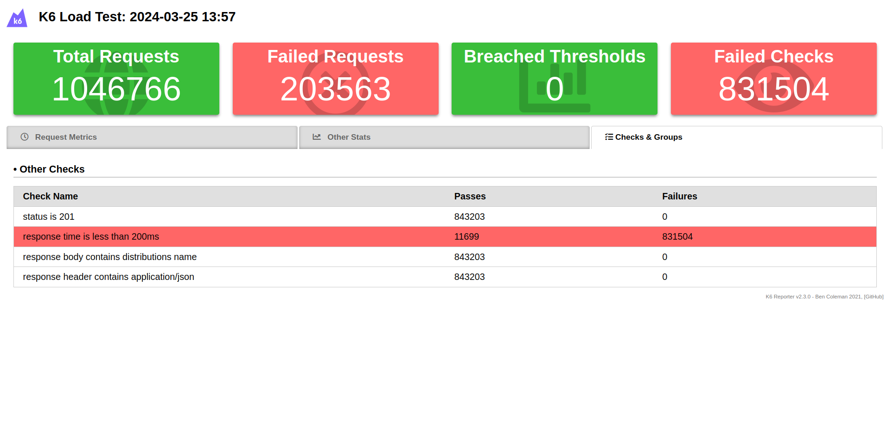

# Avaliando a performance da minha aplicação

## Introdução
Este relatório aborda a utilização de requisições HTTP em testes de carga, utilizando a ferramenta k6. O k6 é uma ferramenta de código aberto para testes de carga e de performance que permite aos desenvolvedores criar e executar testes em JavaScript.

## Tecnologia e Conceitos Principais

### HTTP Requests
- **POST Request:** Utilizada para enviar dados para o servidor. No exemplo, é utilizado o método `http.post()` para enviar um payload JSON para autenticar em um serviço.
- **Outros Métodos:** O módulo `http` do k6 suporta diversos outros métodos HTTP, como GET, DELETE, HEAD, OPTIONS, PATCH, PUT, e a função genérica `request()` para qualquer tipo de requisição HTTP. Mas para esse teste especifico utilizaremos como exemplo o POST.

### Tags de Requisição HTTP
- **Tags Automáticas:** O k6 automaticamente aplica tags às requisições HTTP, como método, status, e URL, para facilitar a organização e filtragem dos resultados.
- **Customização de Tags:** É possível customizar tags, como o nome da requisição, para facilitar a análise de métricas. Por exemplo, agrupando URLs sob uma única tag comum.

### Testes de Carga
- **Testes Dinâmicos:** Para casos onde os URLs das requisições são dinâmicos, é importante agrupar os dados para evitar que uma grande quantidade de URLs únicos sobrecarregue a análise de métricas.
- **Alternativa de Agrupamento:** Além de definir manualmente as tags, é possível utilizar a função `http.url` para definir o nome da tag com um template de string.

## Relatório do Código - Detalhes da Implementação

O teste de carga implementado tem como objetivo simular a distribuição de pesquisas por meio de requisições HTTP para o servidor hospedado na AWS EC2. Foi utilizada a ferramenta k6 para realizar requisições POST em um endpoint específico, avaliando métricas como taxa de erro, tempo de resposta, taxa de transferência e tempo de conexão.

#### Requisições HTTP
- O teste consiste em realizar requisições POST para o endpoint `http://54.174.44.249:8080/distribuitions/`.
- Cada requisição envia um payload JSON contendo informações sobre a distribuição da pesquisa.
- As requisições são enviadas em um loop contínuo, com uma pausa de 1 segundo entre cada requisição.

#### Métricas Avaliadas
- **Taxa de Erro:** É calculada a partir do status da resposta da requisição, onde qualquer status igual ou superior a 400 é considerado um erro.
- **Tempo de Resposta:** O tempo de resposta de cada requisição é registrado e analisado para identificar padrões de desempenho.
- **Taxa de Transferência:** É calculada com base no tempo de resposta e no tamanho do corpo da resposta.
- **Tempo de Conexão:** O tempo de conexão é registrado para avaliar o desempenho da conexão com o servidor.

#### Critérios de Validação
- O teste inclui validações para garantir que as respostas das requisições estejam de acordo com as expectativas:
  - Verificação de que o status da resposta seja 201 (Created).
  - Verificação de que o tempo de resposta seja inferior a 200ms.
  - Verificação de que o corpo da resposta contenha o nome da distribuição da pesquisa.
  - Verificação de que o cabeçalho da resposta contenha o tipo de conteúdo 'application/json'.

O teste de carga implementado demonstra o comportamento de POST de distribuição de pesquisas por meio de requisições HTTP. As métricas avaliadas permitem identificar possíveis gargalos de desempenho e falhas no servidor, garantindo a qualidade e confiabilidade do sistema em produção. As validações adicionadas asseguram que as respostas das requisições estejam conforme o esperado, contribuindo para a detecção precoce de problemas e a melhoria contínua do sistema.

## Registro Visual do processo - Resultados

Utilizou-se a ferramenta K6 HTML Report Exporter para gerar um relatório visual com os resultados dos testes desenvolvidos. Docs completa da API: https://github.com/benc-uk/k6-reporter

#### Output do terminal

### Request Metrics

Essa foto mostra várias métricas relacionadas a requisições HTTP:

- http_req_duration: O tempo total da requisição.
- http_req_waiting: O tempo gasto esperando por uma resposta.
- Outras métricas incluem tempo de conexão, handshaking TLS, envio, recebimento e bloqueio.

### Other Stats

A segunda foto fornece detalhes sobre verificações personalizadas, que são condições ou afirmações que o teste verifica, como:

- Códigos de status HTTP.
- Tempos de resposta.
- Verificações de conteúdo nas respostas de corpos e cabeçalhos.

### Checks & Groups

A terceira foto exibe as estatísticas gerais do teste:

- Checks: Afirmações durante o teste.
- Iterations: O número de vezes que o teste foi executado.
- Virtual Users: Usuários simulados fazendo requisições.
- Data Received e Data Sent: Quantidade de dados transferidos.

### Análise dos Resultados

- Total de Requisições: 1.789 requisições foram feitas sem falhas.
- Tempos de Resposta: A requisição média levou 5,5 segundos, com um máximo de 23,4 segundos.
- Checks: 7.156 verificações passaram, sugerindo que todas as afirmações definidas foram atendidas.
- Usuários Virtuais: Apenas 1 usuário foi simulado, o que não representa um teste de carga pesada.
- Transferência de Dados: Uma pequena quantidade de dados foi transferida; 1,32 MB recebidos e 0,59 MB enviados.
- Desempenho: Nenhum limiar foi ultrapassado ou verificações falharam, indicando que o endpoint lidou bem com este teste.
- Verificações Personalizadas: Todas as verificações personalizadas passaram, tais como o código de status 201 e tempos de resposta inferiores a 200ms.

## Conclusão
A utilização de requisições HTTP em testes de carga é essencial para avaliar o desempenho e a robustez de aplicações. Com o k6, podemos criar testes robustos e analisar os resultados de forma eficiente, garantindo assim a qualidade e performance das aplicações. A customização de tags e o agrupamento de dados são técnicas importantes para simplificar a análise dos resultados em testes com URLs dinâmicos.
